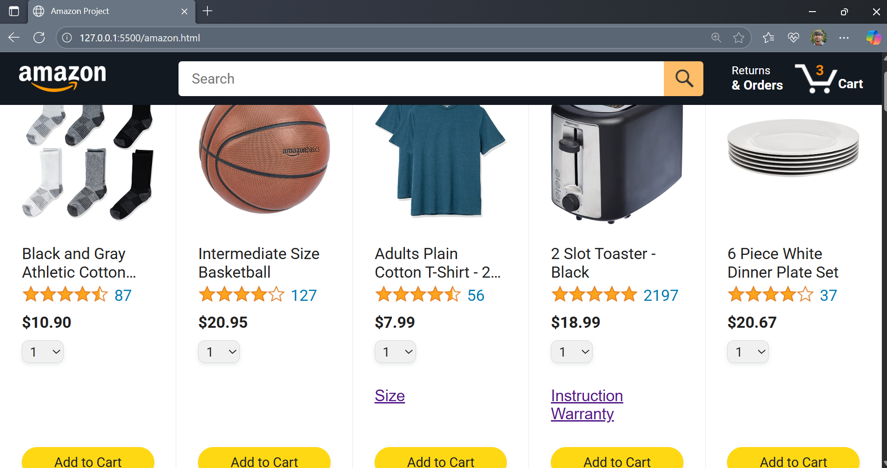
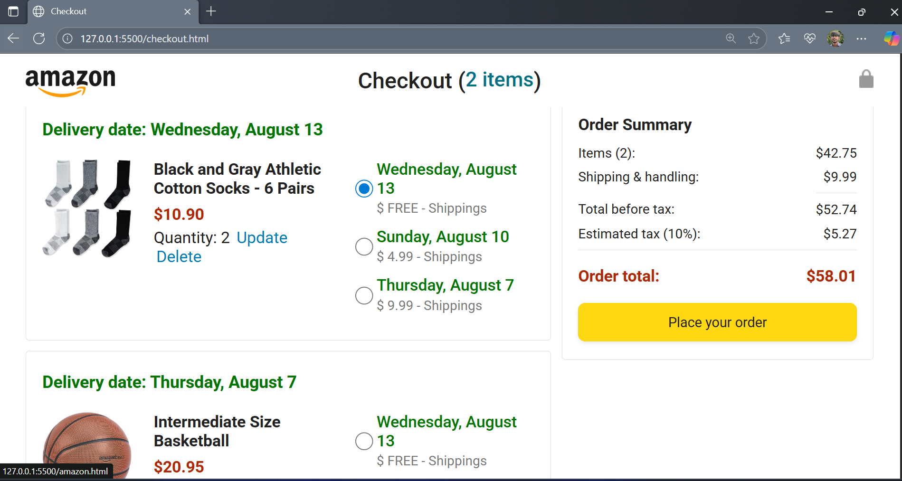
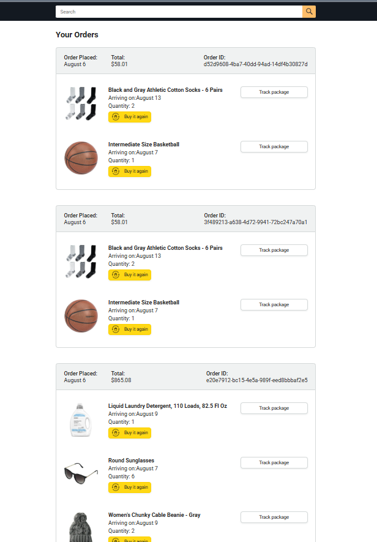
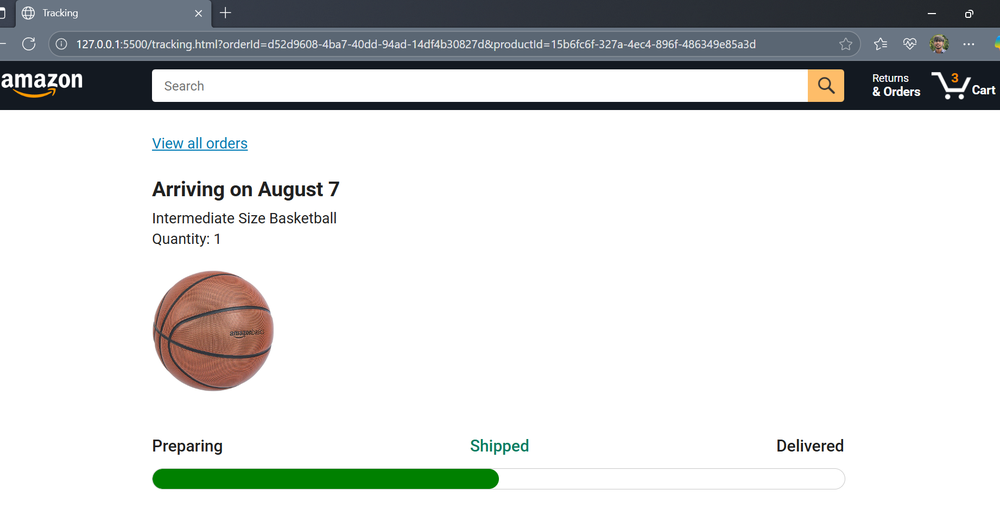

# Amazon Clone (JavaScript Project)

## 📌 About
This is a mini e-commerce clone built with vanilla JavaScript, HTML, and CSS. It replicates core shopping features including browsing, adding to cart, checkout, and order tracking. Inspired by the SuperSimpleDev course.

## ⚙️ Features
- Product listing and ratings
- Add to cart with quantity + delivery options
- Payment summary with tax and shipping
- Place order with simulated backend
- Track orders with tracking page
- Responsive UI with product images

## 🗂️ Project Structure
```
/backend                  ← mock backend setup (if any)
/data                     ← JS modules: products, cart, delivery options, orders
/images                   ← product and rating images
/scripts                  ← UI rendering and logic handlers
/styles                   ← CSS styling (global & page specific)

amazon.html               ← Home/product listing
checkout.html             ← Cart & payment
orders.html               ← View all placed orders
tracking.html             ← Track delivery status
```

## 🚀 How to Run
1. **Clone this repo**
   ```bash
   git clone https://github.com/sagar-bn/javascript-amazon-project-main.git
   ```

2. **Open with Live Server or a local web server**
   > ⚠️ JS modules need to run via a server (`file://` won't work)

3. Navigate:
   - `amazon.html` → Shop
   - `checkout.html` → Cart + Checkout
   - `orders.html` → View Orders
   - `tracking.html` → Track Delivery

## 🛒 Cart & Order Handling
- Cart and Orders are handled using in-memory JS objects (or optionally `localStorage`)
- After placing an order:
  - Cart is cleared
  - Order is saved using `addOrder()`
- `orders.html` and `tracking.html` read from the saved orders

## 💡 Tips
- Ensure all scripts use `type="module"`
- Validate file paths if images or JS fail
- If `tracking.html` shows an error, check if the order data exists
- Backend API (`https://supersimplebackend.dev/orders`) must return proper order format

## 📷 Demo Screens





---
-Sagar B N

